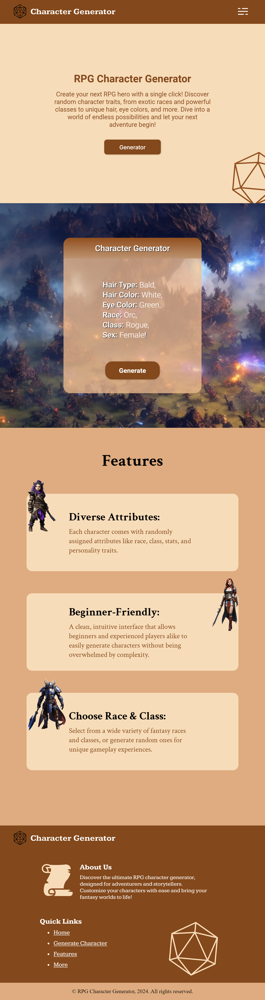
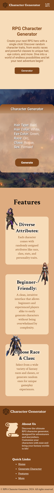

# Random-Character

This [Random-Character](https://github.com/IgorDGomes/Random-Character) was made as a challenge to try out my understanding about if statement using javascript, the backend is being developed with typescript for a better error handling, .

## Table of Contents

- [Preview](#preview)
- [About](#about)
- [Built with](#built-with)
- [Credits](#credits)
- [More](#more)

## Preview

### Desktop

Main page

### Tablet

Main page

### Mobile

Main page

## About

This project was made to easily create a character for a RPG game, each characteristic has randomly generated output, among the options your character can have:

### Characteristics

Hair Type

---

  - Curly

  - Wavy

  - Straight

  - Bald

Hair Color

---

  - Black

  - Brown

  - Blonde

  - White

  - Ginger

Eye Color

---

  - Black

  - Blue

  - Green

  - Grey

  - Purple

  - Red

  - White

  - Brown

  - Yellow

  - Pink

  - Orange

Race

---

  - Elf

  - Human

  - Orc

  - Dwarf

  - Night Elf

  - DragonBorn

  - Fairy

  - Goblin

  - Half

Class

---

  - Soldier

  - Knight

  - Barbarian

  - Paladin

  - Black Mage

  - White Mage

  - Red Mage

  - Rogue

  - Archer

  - Engineer

  - Fighter

  - Summoner

  - Tamer

  - No Class

  - 2 random classes

  - 3 random classes

  - 2 classes of your choice

  - 3 classes of your choice

  - ?

Sex

---

  - Male

  - Female

## Built with

- HTML
- CSS
- Javascript

## Credits

[Designer --> Denisa](https://dribbble.com/DenTg)

## More

The backend is being developed.